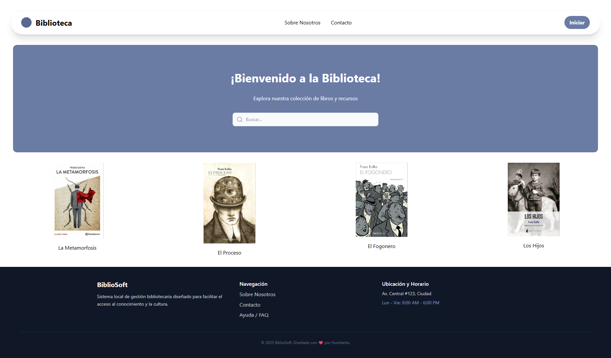
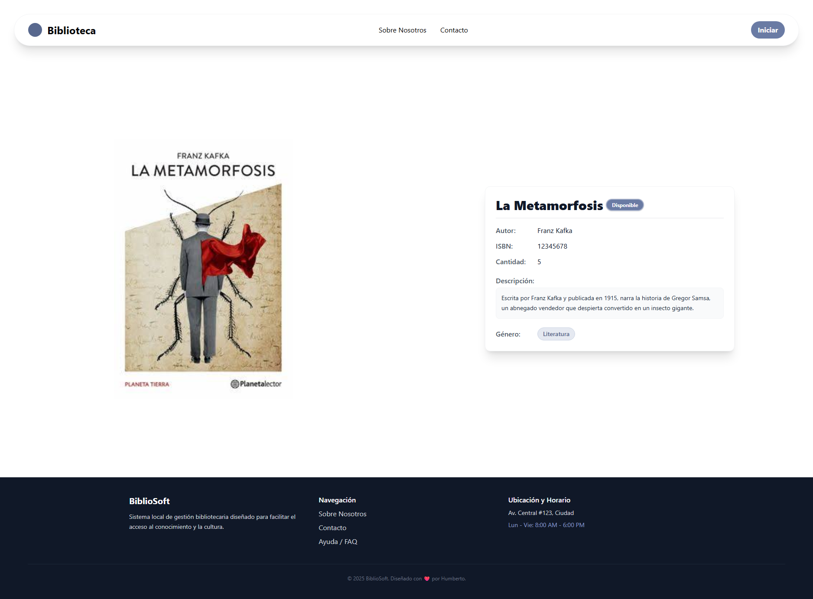
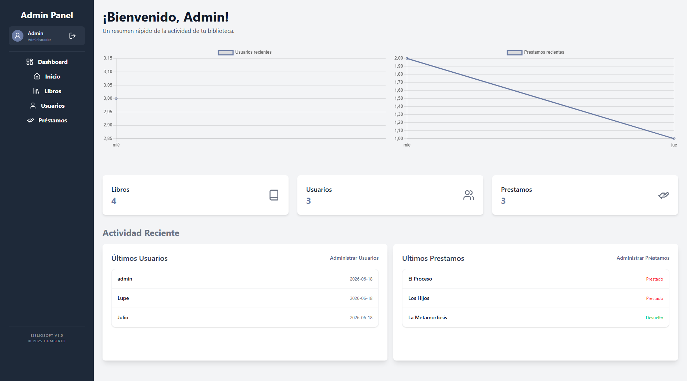
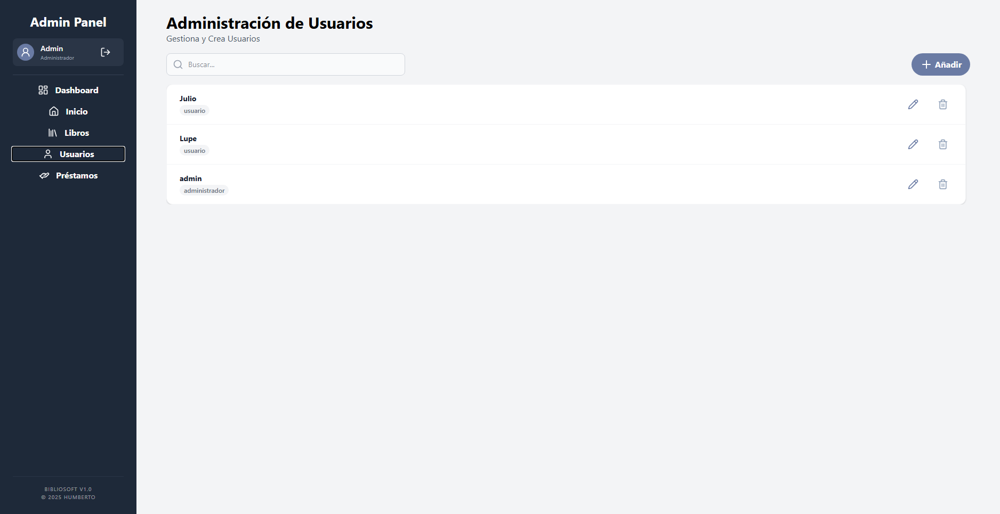
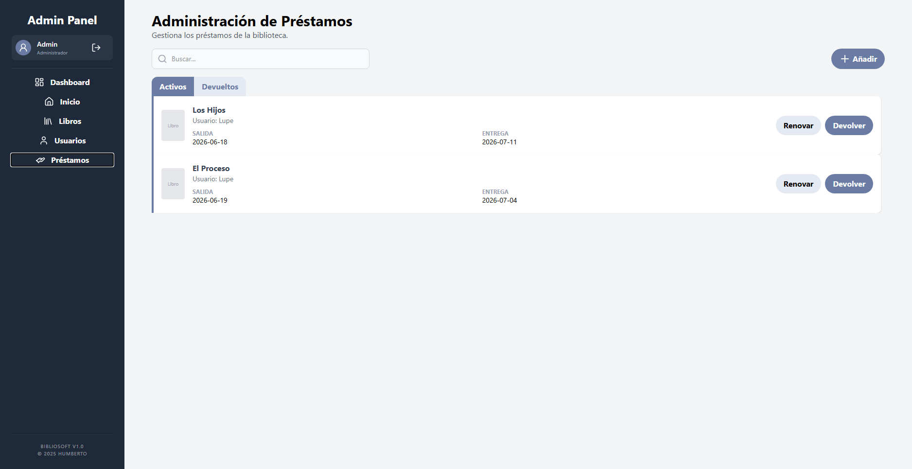
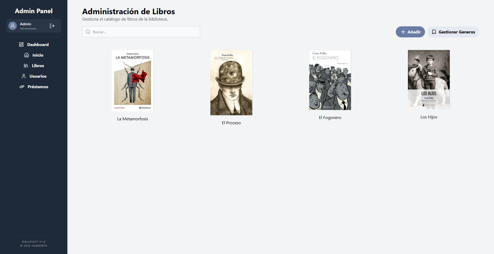
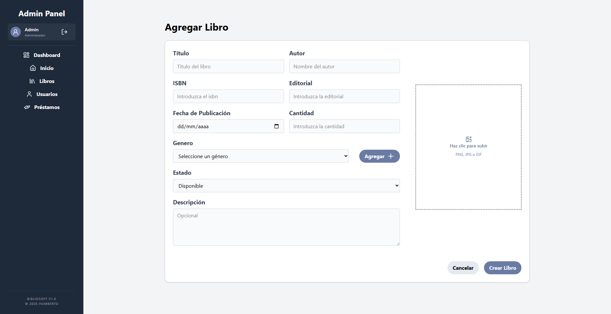
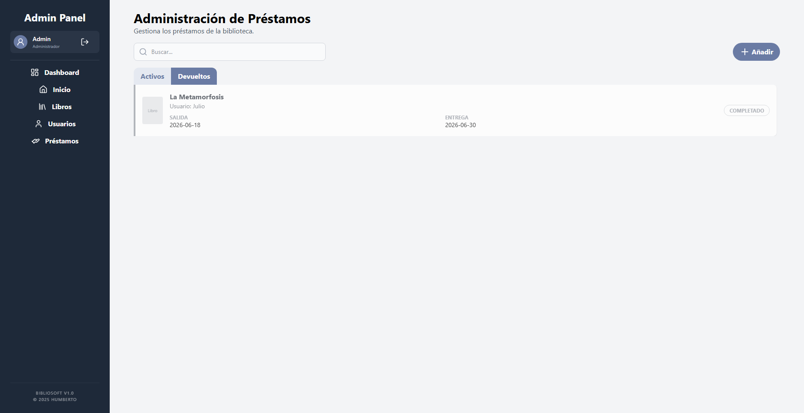

# Biblisoft

Un sistema moderno y eficiente para la gestión y administración de bibliotecas. El proyecto cuenta con una arquitectura desacoplada, separando completamente el Frontend del Backend para un desarrollo limpio y escalable.

## ✨ Características Principales
- **Gestión de Usuarios:** Control de acceso con roles (Administrador, Bibliotecario, Usuario).
- **Control de Inventario:** Registro, actualización y baja de libros.
- **Préstamos y Devoluciones:** Historial de movimientos y alertas de entrega.
- **Panel Estadístico:** Gráficos en tiempo real sobre el flujo de libros y usuarios activos.

## 🛠️ Tecnologías Utilizadas
### Frontend
- **Framework:** React
- **Estilos:** Tailwind CSS
- **Gestión de Estado y Peticiones:** React Query & Axios
- **Gráficos:** Chart.js
- **Iconografía:** Lucide React

### Backend
- **Framework:** Django REST Framework
- **Base de Datos:** SQLite (Entorno de desarrollo)

## 📦 Instalación y Configuración

Instrucciones para clonar y ejecutar el proyecto de forma local. Asegúrate de tener instalado **Python 3.x** y **Node.js (LTS)** en tu sistema.

### 1. Clonar el Repositorio
```bash
git clone https://github.com/Nowht/Biblioteca-Gestion.git
cd Biblioteca-Gestion
```

### 2. Configuracion Backend
Entra a la carpeta `backend`, inicializa el entorno virtual e instala las dependencias:
```bash
cd backend

# En Windows:
python -m venv venv
.\venv\Scripts\activate

# En Linux/macOS:
python3 -m venv venv
source venv/bin/activate

# Instalar dependencias
pip install -r requirements.txt

# Aplicar migraciones e iniciar servidor
python manage.py migrate
python manage.py runserver
```
El servidor backend estará corriendo en `http://127.0.0.1:8000/`

### 3. Configuracion Frontend
En una nueva terminal, entra a la carpeta `frontend` e inicia el servidor de desarrollo:

```bash
cd frontend

# Instalar dependencias
npm install

# Iniciar entorno de desarrollo
npm run dev
```

La aplicación web estará disponible en el puerto local indicado por Vite (usualmente `http://localhost:5173/`).

## 📸 Capturas de Pantalla

<p align="center">

</p>

<p align="center">

</p>

<p align="center">

</p>

<p align="center">

</p>

<p align="center">

</p>

<p align="center">

</p>

<p align="center">

</p>

<p align="center">

</p>
